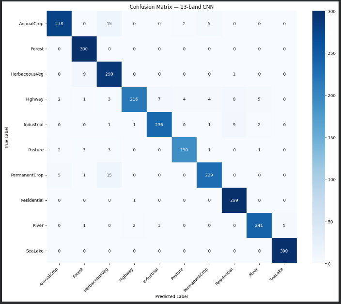
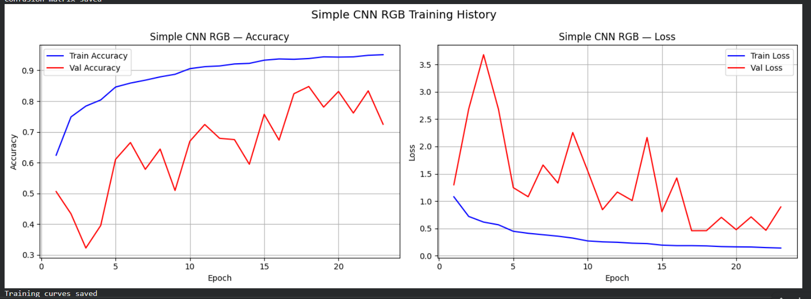
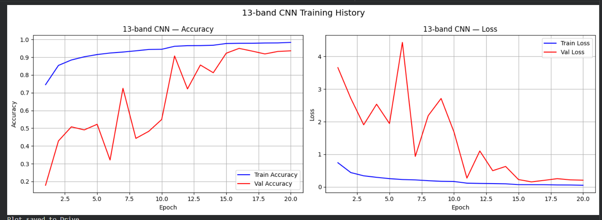

# EuroSAT Land Classification — RGB vs Multispectral Analysis

A deep learning project comparing RGB and 13-band multispectral satellite image 
classification using the EuroSAT dataset based on Sentinel-2 satellite imagery.

## Dataset

**EuroSAT** — Sentinel-2 Satellite Image Dataset
- 27,000 labeled and geo-referenced image patches
- Image size: 64×64 pixels (GSD: 10m per pixel = 640m × 640m real coverage)
- Two versions: RGB (3 bands) and Multispectral (13 bands, .tif format)
- Pre-split: 18,900 train | 5,400 validation | 2,700 test
- 10 Classes: AnnualCrop, Forest, HerbaceousVegetation, Highway, Industrial, 
  Pasture, PermanentCrop, Residential, River, SeaLake

## Motivation

Standard satellite image classification uses only RGB bands — the same 3 channels 
a regular camera captures. However, Sentinel-2 satellites capture 13 spectral bands 
including Near Infrared (NIR) and Red Edge bands that are invisible to the human eye 
but contain rich information about vegetation health, water bodies, and land cover.

This project investigates:
1. Does ImageNet transfer learning help on satellite imagery?
2. Do extra spectral bands beyond RGB improve classification accuracy?

## Models

### Model 1 — Simple CNN (RGB)
- Input: (64, 64, 3)
- 3 Conv blocks: 32 → 64 → 128 filters
- BatchNormalization + Dropout after each block
- Dense 256 → Output 10 classes
- Data loading: ImageDataGenerator

### Model 2 — ResNet50 Feature Extraction (RGB)
- Input: (224, 224, 3)
- Pretrained on ImageNet, base frozen
- Custom classification head on top
- Data loading: ImageDataGenerator

### Model 3 — Simple CNN (13-band Multispectral)
- Input: (64, 64, 13)
- Identical architecture to Model 1
- Custom tf.data pipeline with rasterio for TIF file loading
- Normalization: pixel values divided by 65535 (uint16 range)

## Results

| Model | Test Accuracy |
|---|---|
| Simple CNN (RGB) | 85.0% |
| ResNet50 Feature Extraction (RGB) | 80.0% |
| **Simple CNN (13-band)** | **95.5%** |

### Key Finding 1 — ImageNet Transfer Learning Hurts on Satellite Data

ResNet50 with frozen ImageNet weights (80.0%) performed worse than a simple CNN 
trained from scratch (85.0%). This demonstrates a significant domain gap between 
natural photos and satellite imagery — ImageNet features simply don't transfer well.

### Key Finding 2 — Multispectral Bands Dramatically Improve Accuracy

Adding 10 extra spectral bands beyond RGB improved accuracy by **+10.5%**, 
from 85.0% to 95.5%.

### Per-Class Improvement

| Class | RGB Accuracy | 13-band Accuracy | Improvement |
|---|---|---|---|
| SeaLake | 87.0% | 100% | +13.0% |
| HerbaceousVeg | 95.3% | 96.7% | +1.4% |
| Pasture | 50.7% | 63.3% | +12.6% |
| River | 64.3% | 80.3% | +16.0% |
| AnnualCrop | 74.0% | 92.7% | +18.7% |
| PermanentCrop | 67.0% | 76.3% | +9.3% |

### Confusion Matrix — Simple CNN RGB


### Confusion Matrix — 13-band CNN


### Training Curves — Simple CNN RGB


### Training Curves — 13-band CNN


## Why Multispectral Helps

Visually similar classes in RGB become separable with extra bands:

| Confusion in RGB | Why | Band that helps |
|---|---|---|
| Pasture vs Forest | Both dark green | NIR — vegetation density |
| SeaLake vs Forest | Both dark | SWIR — water absorption |
| AnnualCrop vs PermanentCrop | Both flat fields | Red Edge — crop type |
| River vs Highway | Both thin lines | NIR — water reflection |

## Project Structure
```
eurosat-land-classification/
├── EuroSAT_SimpleCNN_RGB.ipynb        # Model 1
├── EuroSAT_ResNet50_RGB.ipynb         # Model 2
├── EuroSAT_13band_CNN.ipynb           # Model 3
├── confusion_matrix_rgb.png           
├── confusion_matrix_13band.png        
├── simplecnn_training_curves.png      
├── 13band_training_curves.png         
└── README.md
```

## Requirements
```
tensorflow>=2.0
rasterio
kagglehub
numpy
pandas
matplotlib
seaborn
scikit-learn
```

## How to Run

1. Clone the repository
```bash
git clone https://github.com/2501600005mca-droid/eurosat-land-classification
```

2. Install dependencies
```bash
pip install tensorflow rasterio kagglehub numpy pandas matplotlib seaborn scikit-learn
```

3. Run notebooks in order:
   - `EuroSAT_SimpleCNN_RGB.ipynb`
   - `EuroSAT_ResNet50_RGB.ipynb`  
   - `EuroSAT_13band_CNN.ipynb`

## References

- Helber, P., Bischke, B., Dengel, A., & Borth, D. (2019). EuroSAT: A Novel 
  Dataset and Deep Learning Benchmark for Land Use and Land Cover Classification.
  IEEE Journal of Selected Topics in Applied Earth Observations and Remote Sensing.
- Dataset: https://github.com/phelber/EuroSAT
- Kaggle: https://www.kaggle.com/datasets/apollo2506/eurosat-dataset
